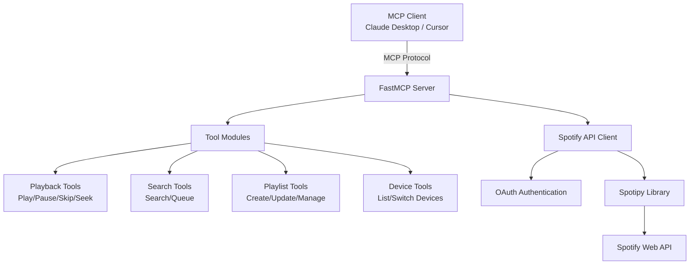

# Spotify MCP Server

Control Spotify directly from Claude and other MCP-enabled clients. Built on [spotipy](https://github.com/spotipy-dev/spotipy/tree/2.24.0).

## Architecture



## Features

✅ **Playback Control** - Play, pause, skip, seek, shuffle, repeat  
✅ **Search** - Find tracks, albums, artists, and playlists  
✅ **Queue Management** - Add songs, view queue  
✅ **Playlists** - Create, update, and manage playlists  
✅ **Device Management** - List and switch between Spotify devices

## Demo

<details>
  <summary>📹 Video Demo (turn on audio)</summary>
  https://github.com/user-attachments/assets/20ee1f92-f3e3-4dfa-b945-ca57bc1e0894
</details>

## Quick Start

### Prerequisites

- **Spotify Premium Account** (required for API access)
- Python 3.12+
- `uv` package manager ([install here](https://docs.astral.sh/uv/))

### 1. Get Spotify API Credentials

1. Go to [Spotify Developer Dashboard](https://developer.spotify.com/dashboard)
2. Create a new app
3. Set **Redirect URI** to: `http://127.0.0.1:8080/callback`
4. Copy your **Client ID** and **Client Secret**

> ⚠️ Must use `http://` and explicit loopback address (127.0.0.1). See [Spotify docs](https://developer.spotify.com/documentation/web-api/concepts/redirect_uri) for details.

### 2. Configure MCP Client

#### Option A: Run with `uvx` (Easiest)

Add to your MCP config (e.g., `~/Library/Application\ Support/Claude/claude_desktop_config.json` on macOS):

```json
{
  "mcpServers": {
    "spotify": {
      "command": "uvx",
      "args": [
        "--python", "3.12",
        "--from", "git+https://github.com/or-ben-harosh/spotify-mcp",
        "spotify-mcp"
      ],
      "env": {
        "SPOTIFY_CLIENT_ID": "your_client_id_here",
        "SPOTIFY_CLIENT_SECRET": "your_client_secret_here",
        "SPOTIFY_REDIRECT_URI": "http://127.0.0.1:8080/callback"
      }
    }
  }
}
```

#### Option B: Run Locally (Better for Development)

Clone and run locally to avoid re-authentication on each request:

```bash
git clone https://github.com/or-ben-harosh/spotify-mcp.git
cd spotify-mcp/src
```

Add to MCP config:

```json
{
  "mcpServers": {
    "spotify": {
      "command": "uv",
      "args": [
        "--directory",
        "/absolute/path/to/spotify-mcp/src",
        "run",
        "spotify-mcp"
      ],
      "env": {
        "SPOTIFY_CLIENT_ID": "your_client_id_here",
        "SPOTIFY_CLIENT_SECRET": "your_client_secret_here",
        "SPOTIFY_REDIRECT_URI": "http://127.0.0.1:8080/callback"
      }
    }
  }
}
```

### 3. Restart Your MCP Client

Restart Claude Desktop (or your MCP client) to load the server. You may need to restart once or twice for OAuth to complete.

## Development

### Run with MCP Inspector

The MCP Inspector allows you to test and debug tools:

```bash
cd /path/to/spotify-mcp/src
mcp dev server.py
```

Create a `.env` file in the `src` directory:

```bash
SPOTIFY_CLIENT_ID=your_client_id
SPOTIFY_CLIENT_SECRET=your_client_secret
SPOTIFY_REDIRECT_URI=http://127.0.0.1:8080/callback
```

### Project Structure

```
spotify-mcp/
├── src/
│   ├── server.py              # Main MCP server
│   ├── spotify_api.py         # Spotify API client wrapper
│   ├── config.py              # Configuration & logging
│   ├── utils.py               # Helper utilities
│   ├── pyproject.toml         # Python dependencies
│   ├── helpers/               # Shared helper modules
│   │   ├── auth_helpers.py
│   │   ├── device_helpers.py
│   │   ├── error_handler.py
│   │   └── parsers.py
│   └── tools/                 # MCP tool implementations
│       ├── playback.py        # Play/pause/skip/seek
│       ├── search.py          # Search & queue
│       ├── playlists.py       # Playlist management
│       └── devices.py         # Device switching
```

## Troubleshooting

| Issue                      | Solution                                                                                             |
| -------------------------- | ---------------------------------------------------------------------------------------------------- |
| OAuth redirect not working | Ensure redirect URI is exactly `http://127.0.0.1:8080/callback` in both Spotify Dashboard and config |
| "Premium required" error   | Spotify API requires a Premium subscription                                                          |
| Server not loading         | Update `uv` to version ≥0.54, restart MCP client                                                     |
| Permission errors (local)  | Run `chmod -R 755` on the project directory                                                          |

### Getting Logs

- **macOS**: `~/Library/Logs/Claude`
- **Windows**: `%APPDATA%\Claude\logs`
- **Other platforms**: [MCP Logging Guide](https://modelcontextprotocol.io/quickstart/user#getting-logs-from-claude-for-desktop)

### MCP Config Locations

- **macOS**: `~/Library/Application Support/Claude/claude_desktop_config.json`
- **Windows**: `%APPDATA%/Claude/claude_desktop_config.json`
```

## Contributing

PRs welcome! Priority areas:

- 🧪 Test coverage
- 📄 Pagination support for search results/playlists/albums
- 📝 Documentation improvements

Thanks to [@jamiew](https://github.com/jamiew), [@davidpadbury](https://github.com/davidpadbury), [@manncodes](https://github.com/manncodes), [@hyuma7](https://github.com/hyuma7), [@aanurraj](https://github.com/aanurraj), [@JJGO](https://github.com/JJGO), and others for contributions!

> **Note**: Some Spotify API features have been [deprecated as of November 2024](https://techcrunch.com/2024/11/27/spotify-cuts-developer-access-to-several-of-its-recommendation-features/).

## License

See [LICENSE](LICENSE) file for details.
