# Spotify MCP Server

<div align="center">

[]()
[]()
[]()
[]()

**Control Spotify directly from Claude and other MCP-enabled clients using the power of [Spotipy](https://github.com/spotipy-dev/spotipy/tree/2.24.0)**

[Features](#features) • [Quick Start](#quick-start) • [Installation](#installation) • [Development](#development) • [Troubleshooting](#troubleshooting)

</div>

---

## Overview

The Spotify MCP Server bridges the Model Context Protocol with Spotify's Web API, enabling AI assistants like Claude to control your music playback, manage playlists, search for content, and more—all through natural conversation.

### Architecture

```mermaid
graph TB
    Client[MCP Client]
    
    Client -->|MCP Protocol| Server[FastMCP Server]
    
    Server --> Tools[Tool Modules]
    Tools --> Playback[Playback Tools<br/>Play • Pause • Skip • Seek]
    Tools --> Search[Search Tools<br/>Search • Queue]
    Tools --> Playlists[Playlist Tools<br/>Create • Update • Manage]
    Tools --> Devices[Device Tools<br/>List • Switch Devices]
    
    Server --> API[Spotify API Client]
    API --> Auth[OAuth 2.0 Authentication]
    API --> Spotipy[Spotipy Library]
    
    Spotipy --> Spotify[Spotify Web API]
```



## Features

<table>
<tr>
<td width="50%">

### Playback Control
- Play, pause, and resume
- Skip forward/backward
- Shuffle and repeat modes
- Seek to specific timestamps
- Volume control

</td>
<td width="50%">

### Search & Discovery
- Search tracks, albums, artists
- Find and browse playlists
- Add songs to queue
- View current queue

</td>
</tr>
<tr>
<td width="50%">

### Playlist Management
- Create new playlists
- Add/remove tracks
- Update playlist details
- Browse your library

</td>
<td width="50%">

### Device Management
- List available devices
- Switch playback between devices
- Control multi-device setups

</td>
</tr>
</table>

## Quick Start

### Prerequisites

Before you begin, ensure you have:

- **Spotify Premium Account** (required for playback control and most features)
-  **Python 3.12 or higher**
-  **`uv` package manager** - [Installation guide](https://docs.astral.sh/uv/)

### Installation

#### Step 1: Get Spotify API Credentials

1. Navigate to the [Spotify Developer Dashboard](https://developer.spotify.com/dashboard)
2. Log in with your Spotify account
3. Click **"Create app"**
4. Fill in the app details:
   - **App name**: Choose any name (e.g., "My MCP Spotify Controller")
   - **App description**: Brief description of your use case
   - **Redirect URI**: `http://127.0.0.1:8080/callback`
   - **API/SDKs**: Select "Web API"
5. Accept the terms and click **"Save"**
6. On your app's dashboard, click **"Settings"**
7. Copy your **Client ID** and **Client Secret** (click "View client secret")

> **Security Note**: Keep your Client Secret private. Never commit it to version control.

> ⚠️ **Important**: You must use `http://` (not `https://`) and the explicit loopback address `127.0.0.1` (not `localhost`). See [Spotify's Redirect URI documentation](https://developer.spotify.com/documentation/web-api/concepts/redirect_uri) for details.

#### Step 2: Configure Your MCP Client

```json
{
  "mcpServers": {
    "spotify": {
      "command": "uvx",
      "args": [
        "--python", "3.12",
        "--from", "git+https://github.com/or-ben-harosh/spotify-mcp",
        "spotify-mcp"
      ],
      "env": {
        "SPOTIFY_CLIENT_ID": "your_client_id_here",
        "SPOTIFY_CLIENT_SECRET": "your_client_secret_here",
        "SPOTIFY_REDIRECT_URI": "http://127.0.0.1:8080/callback"
      }
    }
  }
}
```

Replace `your_client_id_here` and `your_client_secret_here` with your actual credentials from Step 1.

#### Step 3: Restart Your MCP Client

1. Completely quit Claude Desktop (or your MCP client)
2. Relaunch the application
3. On first launch, you'll be prompted to authorize the app via your browser
4. Grant the necessary permissions
5. You may need to restart the client 1-2 times for OAuth to fully complete

### 🎉 You're Ready!

Try asking Claude:
- "Play some jazz music"
- "Skip to the next song"
- "Create a playlist called 'Workout Mix'"
- "What's currently playing?"

## Development

### Local Setup

1. **Clone the repository:**
   ```bash
   git clone https://github.com/or-ben-harosh/spotify-mcp.git
   cd spotify-mcp
   ```

2. **Install dependencies:**
   ```bash
   uv pip install -e .
   ```

3. **Create environment file:**
   
   Create a `.env` file in the `src` directory:
   ```bash
   SPOTIFY_CLIENT_ID=your_client_id
   SPOTIFY_CLIENT_SECRET=your_client_secret
   SPOTIFY_REDIRECT_URI=http://127.0.0.1:8080/callback
   ```

### Testing with MCP Inspector

The MCP Inspector provides a web interface for testing and debugging your tools:

```bash
cd src
mcp dev server.py
```

## Resources

- [Model Context Protocol Documentation](https://modelcontextprotocol.io/)
- [FastMCP Framework](https://github.com/jlowin/fastmcp)
- [Spotify Web API Reference](https://developer.spotify.com/documentation/web-api)
- [Spotipy Documentation](https://spotipy.readthedocs.io/)

---****

<div align="center">

**Made with ❤️ for the MCP community**

[⭐ Star this repo](https://github.com/or-ben-harosh/spotify-mcp) if you find it useful!
</div>